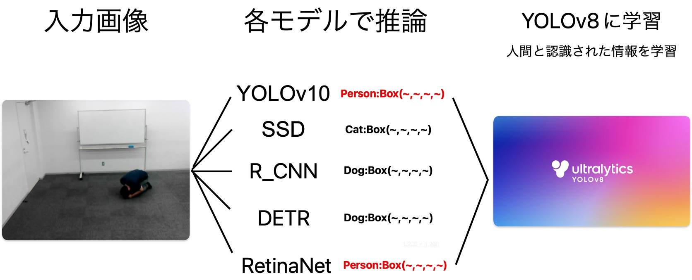
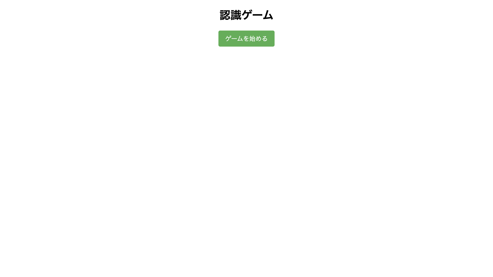
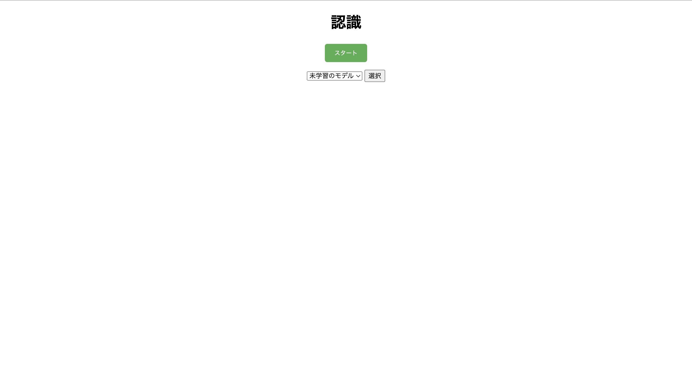
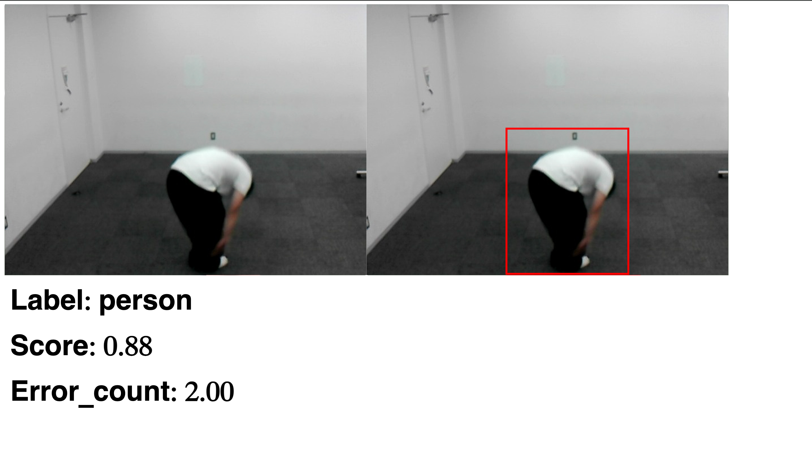
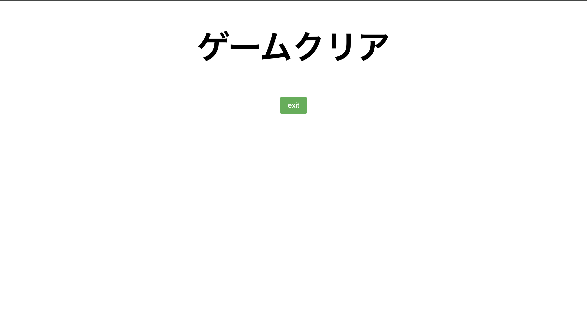
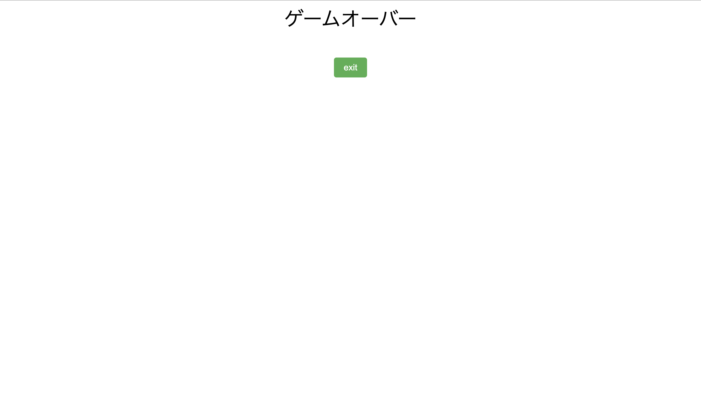

# 物体検出を用いた認識ゲーム
物体認識を用いて人間と認識されないようにするゲーム

## 開発メンバー
[@takusandayooo](https://github.com/takusandayooo)  
[@suzumura0121](https://github.com/suzumura0121)  
[@Yu-pi-5656](https://github.com/Yu-pi-5656)

## ゲームの概要
### 1. AIが4回連続で70%人間と認識するとゲームオーバー
### 2. 人間と認識され確率が70%以下もしくは人間と認識されない場合に学習データに追加
### 3. 学習データを用いて学習を行い、モデルを更新

## 注意事項
- このゲームは一人用に設計されています
- 走っている人間を認識することができません
- ゲーム開始後数秒待ってから開始してください
## 実行環境構築
### 1. ライブラリーのインストール
```bash
pip install -r requirements.txt
```

### 2. トレーニング用のyamlファイルを絶対パスの変更
[`dataset.yaml`](./script/train/dataset.yaml)の`train`と`val`の`path`を絶対パスに変更してください。

### 3. ゲームの実行
[`app.py`](./app.py)を実行してください。
```bash
python app.py
```


### 4. 学習データのトレーニング
[`train.py`](./train_main.py)を実行してください。
```bash
python train_main.py
```
※注意:実行環境によって[`train.py`](./train_main.py)のBatch sizeを変更する必要があります。デフォルトでは50になっています。

## ゲーム遷移
### 1. ゲームスタート
ゲームを始めるをクリック

### 2. モデル選択
使用するモデルを選択  
※1:学習済みモデルを選択した場合は事前に学習を行ってください  
※2:学習済みモデルを選択した後は必ず「選択」ボタンをクリックしてください

### 3. ゲームスタート
ラベルとスコアとエラーカウントが表示される

- ゲームクリアー  
Enterキーを押すとゲームクリアー


- ゲームオーバー  
連続で70%の確率で4回人間と認識された場合はゲームオーバー



## 使用モデル
- ゲーム
    - [YOLOv8n](https://github.com/ultralytics/ultralytics)
- 学習
    - [YOLOv8x](https://github.com/ultralytics/ultralytics)
    - [YOLOv10x](https://github.com/THU-MIG/yolov10)
    - [SSD](https://github.com/rykov8/ssd_keras)
    - [Mask R-CNN](https://github.com/matterport/Mask_RCNN)
    - [RetinaNet](https://github.com/yhenon/pytorch-retinanet)
    - [DETR](https://github.com/facebookresearch/detr)
